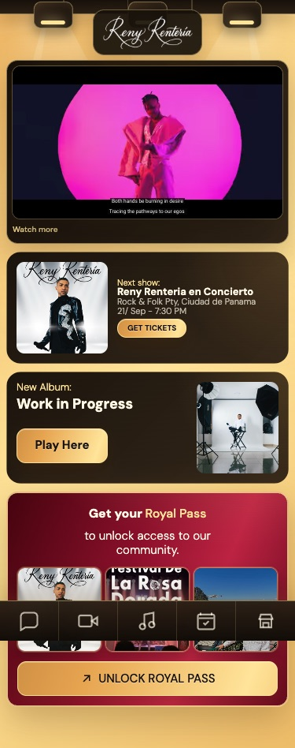
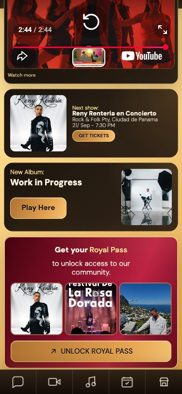
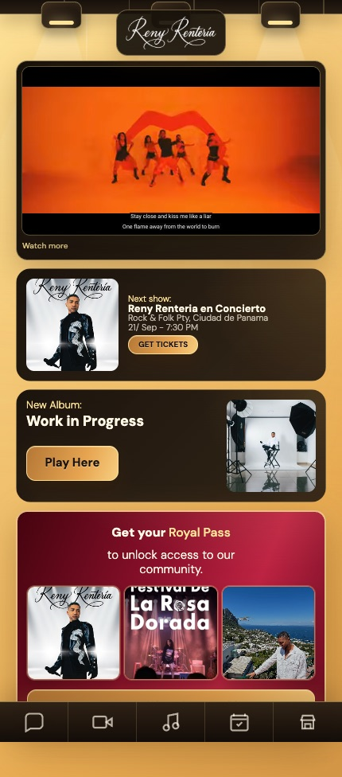
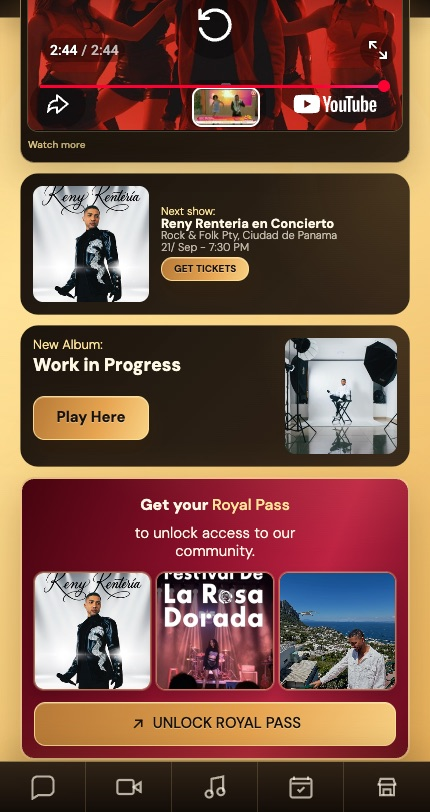
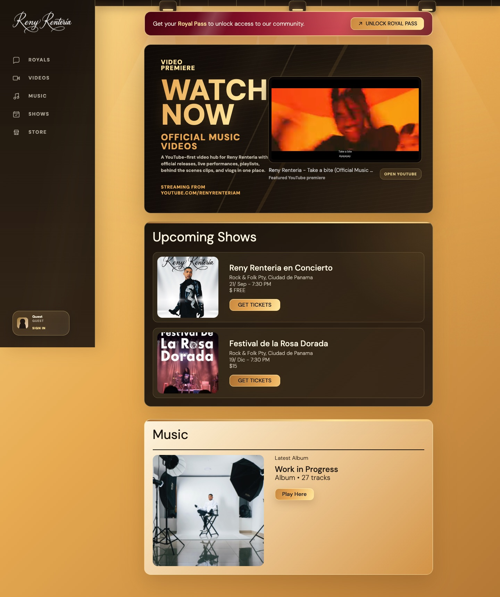

# PR #207 responsive Home UAT

Validated on August 4, 2026 with Playwright against commit `f979a44`.

| Viewport | Concert card | Album card | Play Here | Page scroll width |
| --- | --- | --- | --- | --- |
| 320px | 304 × 142px | 304 × 142px | 116 × 44px | 320px |
| 375px | 359 × 142px | 359 × 142px | 116 × 44px | 375px |
| 390px | 370 × 142px | 370 × 142px | 116 × 44px | 390px |
| 430px | 390 × 142px | 390 × 142px | 116 × 44px | 430px |

At maximum scroll on both captured mobile viewports, the Royal Pass unlock
button ends at `745.75px` (375px viewport) / `745.53px` (430px viewport), while
the fixed navigation begins at `761px`. The button therefore remains fully
visible and tappable above the navigation.

## Screenshots

### 375px

### 430px

### Desktop (1440px)

