# PR #221 visual UAT

Playwright evidence for the Golden Stage redesign of authentication, checkout, and Account.

- Desktop viewport: `1440 x 1100`
- Mobile viewport: `390 x 844`
- Responsive checks: `320`, `375`, `430`, `768`, `1024`, and `1440` px
- Result: no horizontal overflow, clipped dialogs, undersized primary controls, console errors, or content hidden behind the mobile navigation
- Checkout: PayPal's sandbox UI was loaded with the public `sb` client ID; no payment was submitted

## Authentication

| Screen | Desktop | Mobile |
| --- | --- | --- |
| Login | 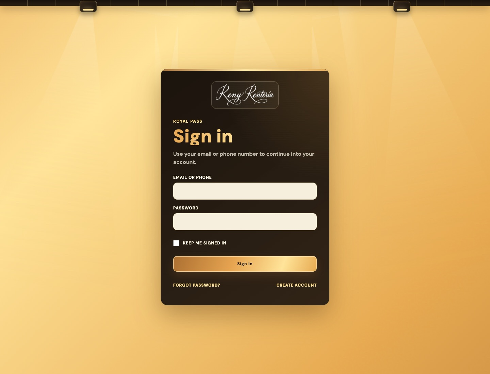 | 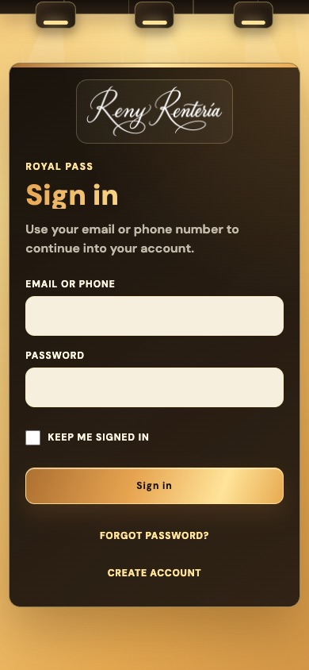 |
| Create account | 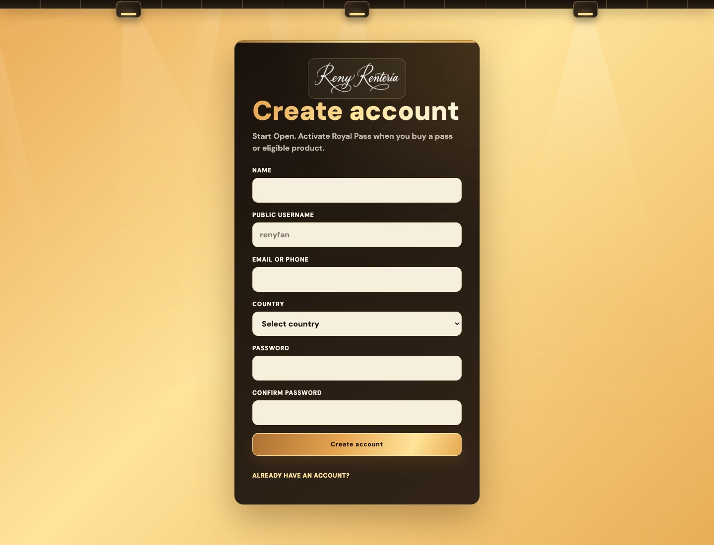 | 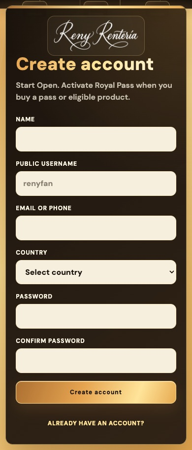 |

## Checkout

| Screen | Desktop | Mobile |
| --- | --- | --- |
| Product page | 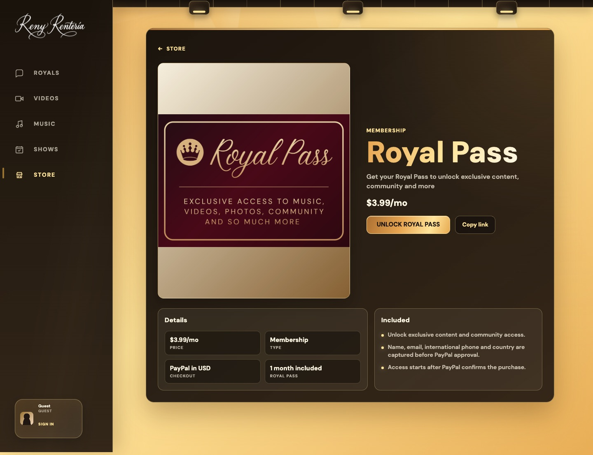 | 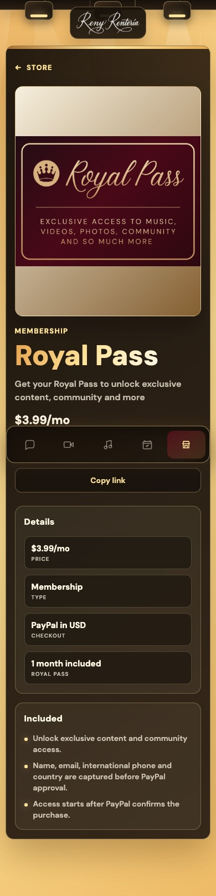 |
| PayPal modal | 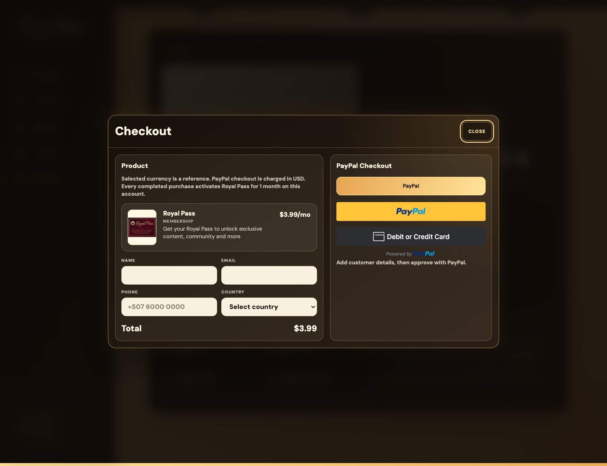 | 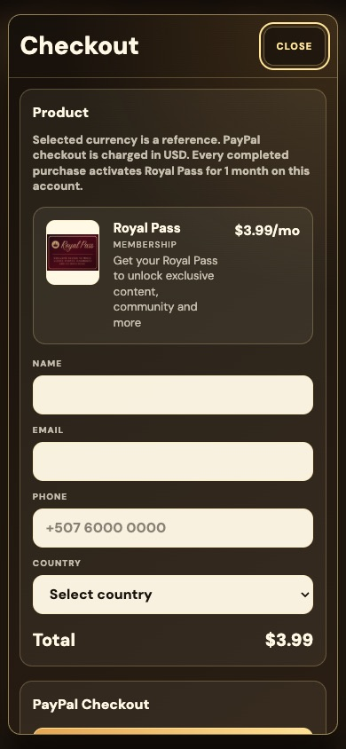 |

The mobile modal scrolls internally. The payment controls remain visible at the end of the modal:

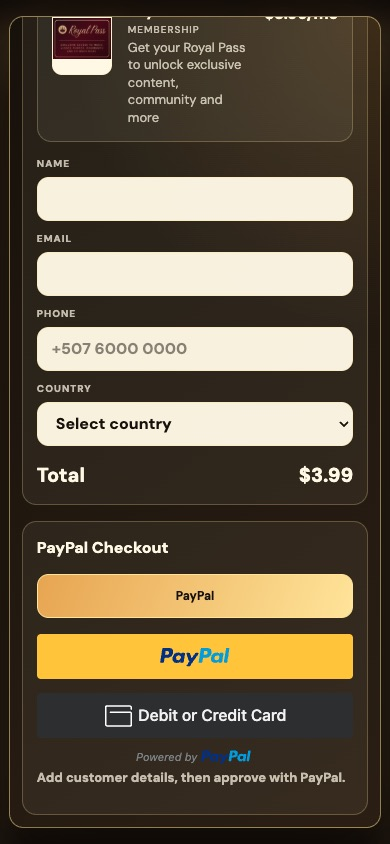

## Account

| Desktop | Mobile |
| --- | --- |
| 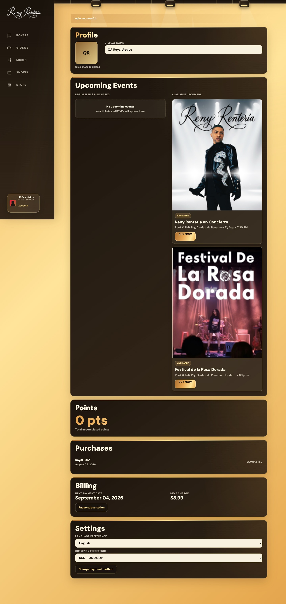 | 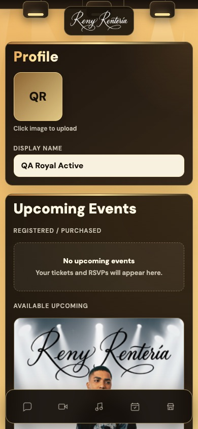 |

[Open the full mobile Account capture](account-mobile-full.jpg).
